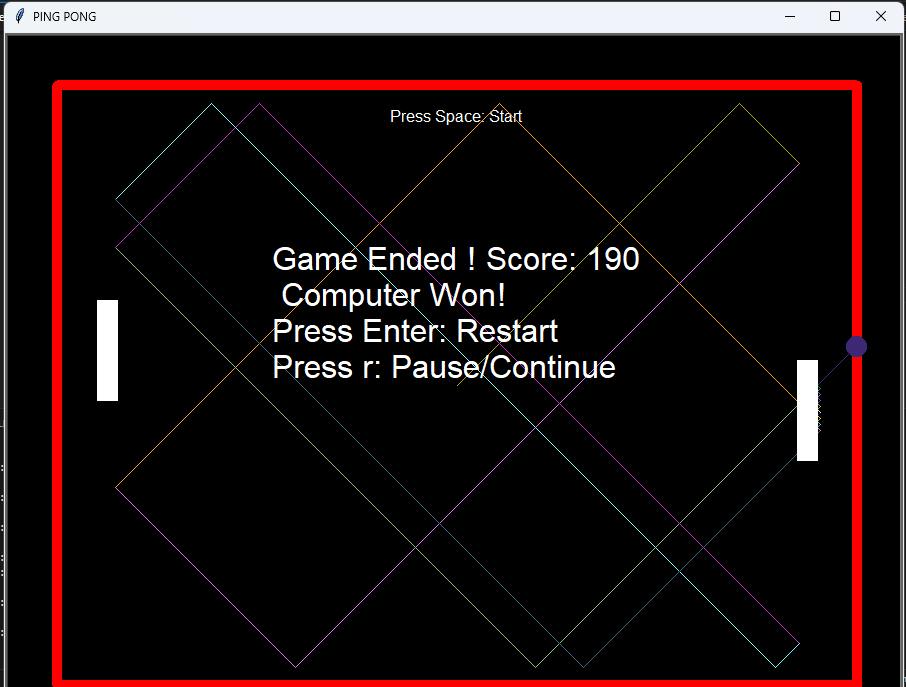
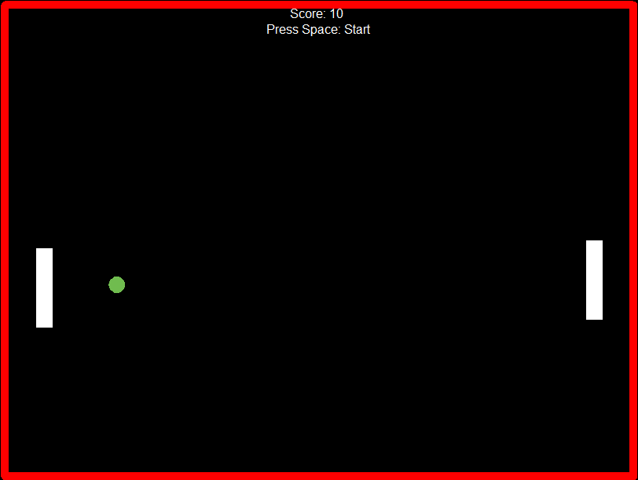

# 🏓 Ping Pong Game - Python Turtle Implementation

A fun and interactive **Ping Pong Game** built using Python's Turtle graphics module.

---

## 📋 Project Overview

The Ping Pong Game is a simple two-player (Player vs Computer) arcade-style game where the ball bounces between paddles. The player controls the right paddle, while the computer controls the left paddle automatically.

### Game Objective:

* Hit the ball with your paddle to keep it in play.
* Score points each time you return the ball successfully.
* Avoid missing the ball — or it’s **Game Over**!

---

## 🚀 Features

* **Randomized Ball Motion:** Ball starts and bounces with random trajectories.
* **Color Dynamics:** Ball changes color on paddle/wall bounce.
* **Player vs Computer:** Computer paddle tracks the ball automatically.
* **Score Tracking:** Real-time score display with 10 points per paddle hit.
* **Game Over Display:** Clear messages for Player Win or Computer Win.
* **Keyboard Controls:** Easy controls to move your paddle.
* **Minimal & Clean UI:** Borders, paddles, ball, and scoreboard neatly displayed.

---

### 🛠️ Language & Libraries

* **Python 3.7+**
* **Turtle** (built-in Python graphics library)
* **Random** (for ball direction and color)

### Dependencies

* No external libraries required — works with standard Python installation.

---

## 📁 Project Structure

```
Ping_Pong_Game/
├── src/
│   ├── screen.py        # Main game loop & event handling
│   ├── paddle.py        # Paddle class (player + computer)
│   ├── ball.py          # Ball class with random motion & color change
│   ├── wall.py          # Border drawing
│   ├── score.py         # Scoreboard and menu messages
├── assets/              # Screenshots
│   ├── ping01.png
│   ├── ping02.png
│── README.md
└── requirements.txt

```

---

## 🔧 Installation & Setup

### Prerequisites

* Python 3.7 or higher
* Turtle module (included by default with Python)

### Setup Instructions

1. **Clone the Repository**

   ```bash
   git clone https://github.com/YourUsername/Ping_Pong_Game.git
   cd Ping_Pong_Game
   ```

2. **Run the Game**

   ```bash
   python screen.py
   ```

---

## 🎮 How to Play

1. **Start the Game**
   Press **Space** to launch the game.

2. **Control the Paddle (Right Side)**

   * **⬆ Up Arrow** → Move paddle up
   * **⬇ Down Arrow** → Move paddle down

3. **Gameplay Rules**

   * Ball bounces off top/bottom walls and paddles.
   * Ball changes color when bouncing.
   * If player misses → **Computer Wins**.
   * If computer misses → **Player Wins**.

4. **Extra Controls**

   * **R** → Restart the game
   * **Enter** → Continue after Game Over

---

## 🧮 Concepts Demonstrated

* **Object-Oriented Programming:** Classes for Ball, Paddle, Scoreboard, and Border.
* **Randomization:** Ball direction and colors.
* **Collision Detection:** Paddle & wall collision handling.
* **Event Handling:** Keyboard inputs for paddle control.
* **Game State Management:** Score updates and game over conditions.

---

## 🐛 Troubleshooting

| Issue                     | Solution                                      |
| ------------------------- | --------------------------------------------- |
| Game window does not open | Ensure Python and Turtle module are installed |
| Controls not responding   | Click inside the game window before playing   |
| Ball moves too fast/slow  | Adjust `new_dx` / `new_dy` values in ball.py  |

---

## 👨‍🎓 Author

**Preetam Prajapati**

* Hobby Project
* Python Turtle Game Development

---

## 📄 License

This project is licensed under the **MIT License**.
You are free to use, modify, and distribute this project with attribution.

---

## 📷 Screenshots

Take a look at how the game looks in action! 🎮🏓

### 🟢 Game End

<a href="assets/ping01.png">  </a>

### 🔵 Gameplay

<a href="assets/ping02.png">  </a>
